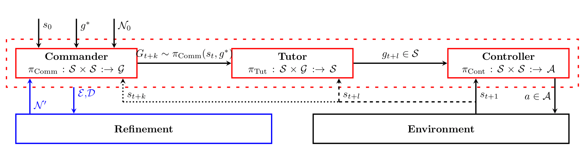

# STAR
This is an implementation for our paper "[Reconciling Spatial and Temporal Abstractions for Goal Representation](https://arxiv.org/abs/2401.09870)" (ICLR 2024).

## Dependencies
- Python 3.6
- PyTorch 1.3
- OpenAI Gym
- MuJoCo
- pyinterval
- tensorflow
- networkx
- scikit-learn

Additionally, this code requires the installation of NNet library https://github.com/sisl/NNet.git and the NeuralVerification.jl library https://github.com/sisl/NeuralVerification.jl.

## Overview
STAR (Spatial and Temporal Abstraction via Reachability) is a Hierarchical Reinforcement Learining algorithm that introduces a both a spatial abstraction a temporal abstraction.
The spatial abstraction takes the form of sets of states and is gradually learned by analyzing reachability relations in the environment.
STAR is composed of 3 agents as depicted in the figure below:
The Commander selects an abstract goal to visit, the Tutor provides a sequence of subgoals that gradually help the Controller to reach the abstract goal. The Controller takes actions into the environment to transition from one state to the next.
The refinement process analyses reachability relations between states and improves the goal abstraction to seperate sets of states exhibiting different dynamics in the task.



## Usage

### Installation
For ease of use, we have included a fully packaged docker image that can be used to directly run the code. 

First, install [Docker](https://docs.docker.com/get-docker/).

Then, clone the repository:
```
git clone https://github.com/cosynus-lix/STAR.git
cd STAR
```

To build the image:
```
docker build -t star .
```

To create a container with the image:
```
docker run -it star
```

It is possible to use Nvidia GPUs with the docker container by installing the  The [NVIDIA Container Toolkit package](https://docs.nvidia.com/datacenter/cloud-native/container-toolkit/latest/index.html) and running the container with the --gpus all flag.
```
docker run --gpus all -it --rm star
```

### Training
The code allows the training of STAR on three tasks: Ant Gather, Ant Maze, and AntMaze Cam. The following commands can be used to train STAR on these tasks:

- Ant Maze
```
python main.py --env_name AntMaze
```

It is also possible to run some of the baseline algorithms from the paper: HIRO, HRAC and GARA. E.g. the following commands can be used to train "[HIRO (Nachum et.al)](https://arxiv.org/pdf/1805.08296v4.pdf)" on the Ant Maze task:
```
python main.py --env_name AntMaze --algo hiro
```


## Citation
If you find this work useful in your research, please cite:
```
@inproceedings{zadem2024reconciling,
      title={Reconciling Spatial and Temporal Abstractions for Goal Representation}, 
      author={Mehdi Zadem and Sergio Mover and Sao Mai Nguyen},
      booktitle={ICLR}
      year={2024},      
}
```
